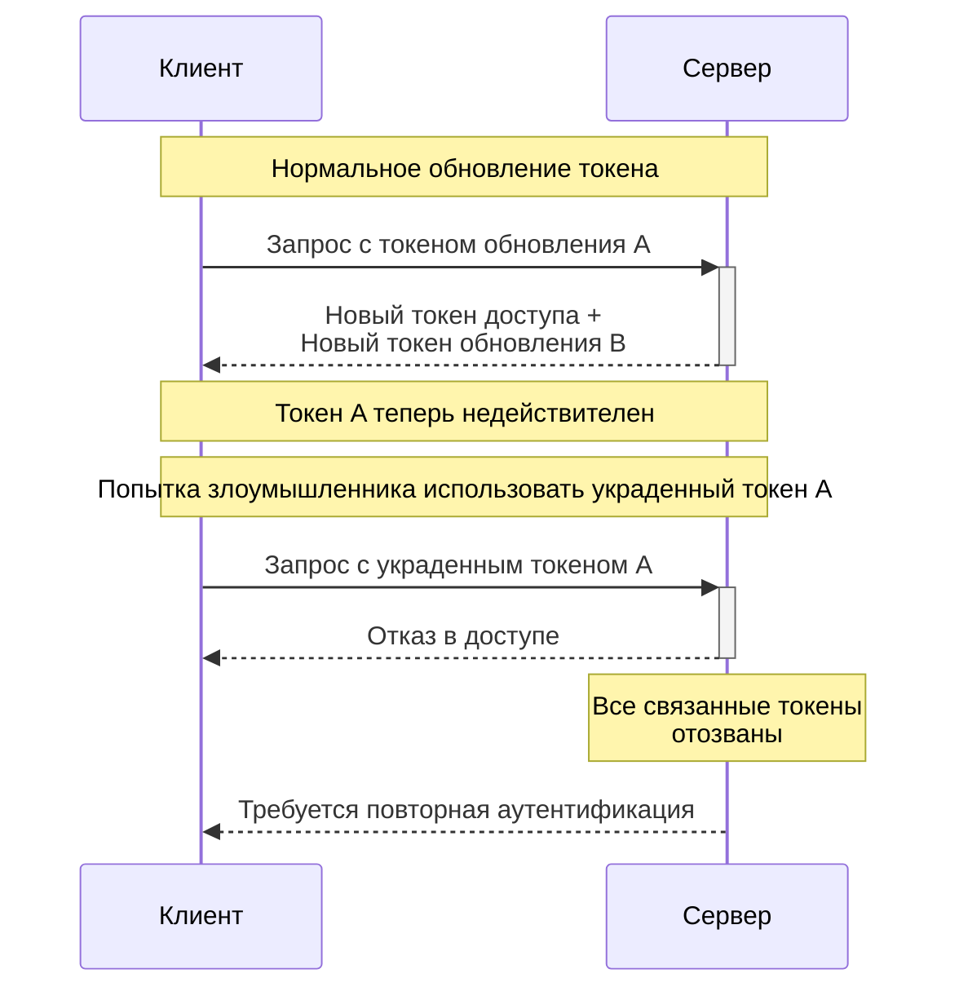

---
tags:
  - inbox
  - development/concepts/auth
created: 2025-02-15T21:48:14+03:00
modified: 2025-02-23T09:46:37+03:00
categories:
  - auth
  - oauth
  - oauth-proxy
  - token-rotation
publish: true
sr-due: 2025-02-26
sr-interval: 3
sr-ease: 250
---

**Ротация токенов** - это механизм безопасности, который обеспечивает периодическую замену старых аутентификационных токенов на новые. При этом каждый раз при использовании токена обновления выдается новая пара токенов, а предыдущий токен становится недействительным.
### Как работает процесс ротации

1. Клиент использует действующий токен обновления для получения нового доступа
2. Сервер генерирует новый набор токенов (токен доступа и токен обновления)
3. Старый токен обновления сразу же отзывается
4. Процесс повторяется при каждом обновлении токена

Такой механизм обеспечивает несколько важных аспектов безопасности:

- Предотвращает многократное использование одного и того же токена
- Защищает от утечки токенов
- Обеспечивает контроль над временем жизни сессии
- Позволяет мгновенно инвалидировать все токены при компрометации

При получении ошибки 401 после попытки обновления токена, клиент должен автоматически выполнить полную аутентификацию, а не пытаться повторно использовать тот же refresh_token.